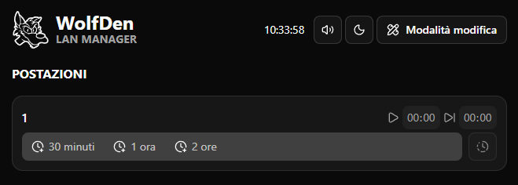
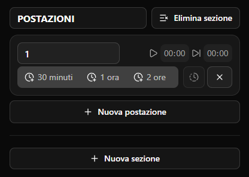

## Il contesto

Un amico gestisce una sala LAN e aveva bisogno di un sistema per monitorare i turni dei clienti alle postazioni. Il vecchio software di cui faceva uso, sviluppato in Java, era funzionale e faceva il suo lavoro ma con un'interfaccia e un'esperienza utente spartana.

{/* SCREENSHOT: Interfaccia vecchia applicazione Java (se disponibile) o descrizione testuale */}

Ho deciso di fare un completo redesign e rework dell'applicazione, trasformandola in una moderna app desktop con Electron e Next.js, mantenendo tutte le funzionalità essenziali ma aggiungendo un'interfaccia intuitiva e funzionalità avanzate.

## La nuova applicazione: WolfDen Manager

WolfDen Manager è un'applicazione desktop cross-platform (Windows, macOS, Linux) costruita con **Electron** e **Next.js 16**, che permette di gestire in modo efficiente i turni dei clienti in una sala LAN.

### Stack tecnologico

  <b>Electron</b>
  <b>Next.js 16</b>
  <b>TypeScript</b>
  <b>Tailwind CSS 4</b>
  <b>Radix UI</b>
  <b>dayJS</b>

<figcaption style={{ textAlign: 'center', color: '#666', fontSize: '0.96em', marginTop: '-0.6em', marginBottom: '2em' }}>
  Interfaccia principale della nuova applicazione WolfDen Manager, con vista su sezioni e postazioni.
</figcaption>

## Funzionalità principali

### Organizzazione in sezioni e postazioni

L'applicazione permette di organizzare le postazioni in **sezioni personalizzabili**. Ogni sezione può contenere multiple postazioni, permettendo una gestione flessibile della sala.

### Sistema di timer avanzato

Il cuore dell'applicazione è il sistema di timer, che offre diverse modalità di gestione:

- **Timer con durata**: Avvio rapido con durate predefinite (30 min, 1 ora, 2 ore) o personalizzate
- **Timer con date/ora specifiche**: Impostazione precisa di inizio e fine turno
- **Aggiunta/rimozione tempo**: Modifica dinamica del timer in corso
- **Progress bar visiva**: Indicatore di avanzamento con colori che cambiano in base al tempo rimanente
- **Notifiche audio**: Allarme quando il timer scade
- **Scambio postazioni**: Trasferimento rapido del timer tra postazioni diverse

### Interfaccia utente

- Supporto tema chiaro/scuro
- Design semplice e pulito
- Layout responsive e accessibile

### Shortcut da tastiera

Per velocizzare le operazioni quotidiane, l'applicazione supporta numerosi shortcut:

- **Ctrl+E**: Attiva/disattiva modalità modifica
- **Ctrl+M**: Attiva/disattiva audio
- **Ctrl+1/2/3**: Avvia timer o aggiungi tempo (1h, 2h, 30min) quando una card è selezionata
- **Ctrl+S**: Scambia postazione (quando timer attivo)
- **Ctrl+R**: Resetta timer
- **Ctrl+Scroll**: Aggiungi/rimuovi tempo con precisione al minuto

### Persistenza dei dati

Tutti i dati (sezioni, postazioni, timer attivi) vengono salvati automaticamente in locale, garantendo che nessuna informazione vada persa anche in caso di chiusura improvvisa dell'applicazione.

Lo stato dell'applicazione è centralizzato in un Context Provider che gestisce:
- Sezioni e postazioni
- Timer attivi
- Aggiornamenti in tempo reale con un singolo interval globale per ottimizzare le performance

{/* SCREENSHOT: Dialog di dettagli timer con informazioni complete */}

## Architettura e design patterns

L'applicazione è stata strutturata secondo un principio di separazione di responsabilità:

- **Features**: Logica di business isolata (cards, sections, timers)
- **Components**: Componenti UI riutilizzabili e composabili
- **Hooks**: Logica riutilizzabile per interazioni e calcoli
- **Services**: Servizi per operazioni complesse (persistenza, timer calculations)