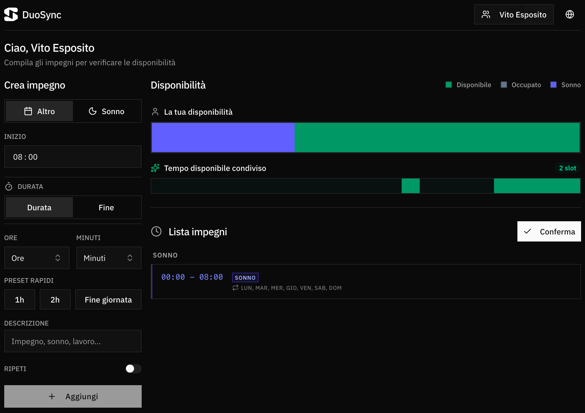
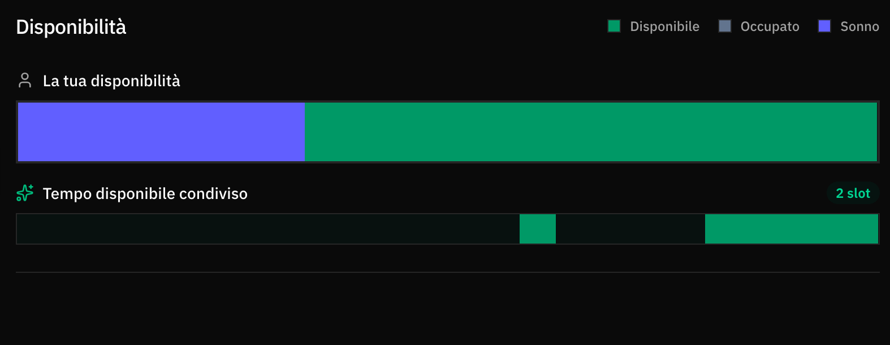
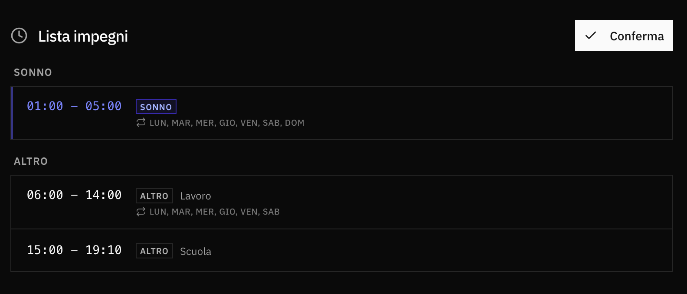

## Il Problema

Tutto è nato dalla difficoltà di trovare un orario per andare in palestra con un mio amico. La situazione era particolare: non era semplice comprendere in maniera chiara quando fossimo liberi, e soprattutto non avevamo quasi mai orari definiti in anticipo. Tra impegni di lavoro, appuntamenti e routine quotidiane che cambiano di giorno in giorno, coordinare gli orari richiedeva continui messaggi che potevano richiedere molti messaggi e molto tempo solo per capire quando entrambi eravamo liberi.

DuoSync nasce da questa esigenza concreta ed è stato progettato per funzionare in situazioni dove gli orari non sono fissi e la comunicazione diretta non è sempre la soluzione più pratica. Supporta fino a 10 utenti, permettendo di visualizzare la disponibilità condivisa e ricevere notifiche quando qualcuno aggiorna i propri impegni.

## La Soluzione


DuoSync è un'applicazione web progressiva costruita con Next.js 16 che permette a gruppi fino a 10 utenti di gestire i propri appuntamenti e visualizzare automaticamente i momenti di disponibilità condivisa. L'applicazione offre una timeline visiva che mostra la disponibilità personale e quella condivisa, gestione appuntamenti one-time e ricorrenti, notifiche push per sincronizzazione automatica, supporto multi-lingua (italiano/inglese), tema chiaro/scuro, e architettura feature-based per manutenibilità e scalabilità.



import { ArrowRightIcon } from 'lucide-react'
import { Button } from '@/components/ui/button'
import Link from '@/components/Link.astro'

<div class="flex w-full justify-center">
  <Button variant="outline" size="lg" className="w-full justify-between">
    <Link href="https://duosync.vitoesposito.it" target="_blank">Vai all'applicazione</Link>
    <ArrowRightIcon className="w-4 h-4" />
  </Button>
</div>

## Come Funziona

Il cuore dell'applicazione è la **timeline di disponibilità**, che mostra due visualizzazioni: la timeline personale mostra tutti gli appuntamenti dell'utente attivo con colori distinti per categoria (sonno, altri impegni, disponibile), mentre la timeline condivisa evidenzia in verde i momenti in cui tutti gli utenti sono liberi contemporaneamente, facilitando la pianificazione di attività comuni.

Gli appuntamenti possono essere creati in due modalità: **one-time** per impegni specifici di una data, o **ricorrenti** con giorni della settimana selezionabili. Il sistema valida automaticamente che non ci siano sovrapposizioni e suggerisce il prossimo slot disponibile quando necessario.

**Non è necessario inserire appuntamenti tutti i giorni**: l'applicazione è pensata per essere utilizzata quando serve, non come un calendario da aggiornare quotidianamente. Quando un utente si ricorda di aggiornare i propri impegni e conferma tramite il pulsante "Conferma", viene inviata automaticamente una notifica push agli altri utenti (se hanno abilitato le notifiche), avvisandoli che l'utente specifico ha confermato i propri impegni. Questo sistema evita che qualcuno si dimentichi di aggiornare: la notifica serve da promemoria e permette agli altri di vedere immediatamente quando la disponibilità è stata aggiornata.



## Le Sfide Tecniche

La gestione degli appuntamenti ricorrenti ha richiesto un'architettura a due livelli: i template ricorrenti sono salvati nella tabella `recurring_appointments` con i giorni della settimana, mentre quando viene richiesta la lista per una data specifica, il sistema applica i template ricorrenti attivi per quel giorno e li combina con gli appuntamenti one-time. Questo approccio permette di modificare o eliminare i template senza dover aggiornare migliaia di record.

L'implementazione delle notifiche push ha richiesto l'integrazione con Web Push API, gestione delle VAPID keys, registrazione delle subscription nel database, e un service worker per gestire l'arrivo delle notifiche. Ho implementato un sistema che invia notifiche solo quando un utente conferma esplicitamente i propri impegni, evitando spam e mantenendo l'utente informato solo quando necessario.



## Architettura e Design Patterns

L'applicazione segue un'architettura **feature-based** dove ogni dominio (appointments, users, availability) ha la propria cartella con servizi di business logic puri e context per la gestione dello stato. I componenti sono presentazionali e ricevono dati tramite hook custom, mantenendo la separazione tra logica e presentazione.

Il sistema di state management utilizza **React Context** con provider isolati per feature. Ogni feature espone un context provider e un hook custom (es. `useAppointments`, `useUsers`) che i componenti utilizzano per accedere allo stato. Questo pattern evita prop drilling e mantiene lo stato locale alla feature, migliorando le performance con re-render mirati.

La persistenza dei dati è gestita tramite **Drizzle ORM** con PostgreSQL. Ho implementato un sistema di migrazioni schema-first dove lo schema è definito in TypeScript e sincronizzato con il database tramite Drizzle Kit. Le query sono ottimizzate con indici su `userId` e `date` per performance efficienti anche con molti appuntamenti.

L'architettura API segue il pattern **Server/Client separation** di Next.js: le route API (`/app/api/*`) gestiscono la validazione e chiamano i servizi di database, mentre i servizi client-side (`features/*/services/*.service.ts`) utilizzano `fetch()` per chiamare le API routes. Questo mantiene una chiara separazione tra browser e server, con validazione sia lato client (per UX) che lato server (per sicurezza).

---

## Showcase video

<div class="my-8 rounded-lg overflow-hidden border border-border bg-muted/30">
  <video 
    controls 
    class="w-full"
    poster="./assets/dashboard.png"
    preload="metadata"
  >
    <source src="/projects/duosync/demo.mp4" type="video/mp4" />
    Il tuo browser non supporta il tag video.
  </video>
</div>

---

## Dettagli Tecnici

<details class="my-4 rounded-lg border border-border bg-muted/30">
<summary class="cursor-pointer px-4 py-2 font-medium hover:bg-muted/50">Stack Tecnologico</summary>
<div class="px-4 pb-4">

| Categoria         | Tecnologia   | Versione | Scopo                          |
| ----------------- | ------------ | -------- | ------------------------------ |
| **Framework**     | Next.js      | 16.0.3   | React framework con App Router |
|                   | React        | 19.2.0   | UI library                     |
| **Linguaggio**    | TypeScript   | 5        | Type safety                    |
| **Database**      | PostgreSQL   | 16       | Database relazionale           |
|                   | Drizzle ORM  | 0.44.7   | ORM type-safe                  |
| **Styling**       | Tailwind CSS | 4        | Utility-first CSS              |
| **UI Components** | Radix UI     | Latest   | Accessible components          |
|                   | lucide-react | 0.554.0  | Icon library                   |
| **Utilities**     | dayjs        | 1.11.19  | Date/time manipulation         |
|                   | date-fns     | 4.1.0    | Date utilities                 |
|                   | sonner       | 2.0.7    | Toast notifications            |
| **PWA**           | next-themes  | 0.4.6    | Theme management               |
|                   | web-push     | 3.6.7    | Push notifications             |

</div>
</details>

<details class="my-4 rounded-lg border border-border bg-muted/30">
<summary class="cursor-pointer px-4 py-2 font-medium hover:bg-muted/50">Funzionalità Principali</summary>
<div class="px-4 pb-4">

| Funzionalità                | Descrizione                                                                   |
| --------------------------- | ----------------------------------------------------------------------------- |
| **Gestione Appuntamenti**   | Creazione, modifica, eliminazione appuntamenti one-time e ricorrenti          |
| **Timeline Visiva**         | Visualizzazione disponibilità personale e condivisa con colori distinti       |
| **Validazione Slot**        | Controllo automatico sovrapposizioni e suggerimento prossimo slot disponibile |
| **Appuntamenti Ricorrenti** | Template ricorrenti con giorni della settimana selezionabili                  |
| **Notifiche Push**          | Notifiche quando un altro utente conferma i propri impegni                    |
| **Multi-utente**            | Supporto fino a 10 utenti con switch rapido tra profili                       |
| **Internazionalizzazione**  | Supporto italiano e inglese con context i18n                                  |
| **Tema Chiaro/Scuro**       | Supporto per preferenze utente e tema di sistema                              |
| **PWA**                     | Installabile come app nativa con service worker                               |
| **Admin Panel**             | Area amministrativa protetta da PIN per gestione utenti                       |

</div>
</details>

<details class="my-4 rounded-lg border border-border bg-muted/30">
<summary class="cursor-pointer px-4 py-2 font-medium hover:bg-muted/50">Architettura</summary>
<div class="px-4 pb-4">

### Struttura Progetto

```
duosync/
├── app/                    # Next.js App Router
│   ├── api/                # API routes (server-side)
│   │   ├── appointments/   # Endpoints per appuntamenti
│   │   ├── notifications/  # Endpoints per push notifications
│   │   └── users/          # Endpoints per utenti
│   ├── admin/              # Area amministrativa
│   ├── onboarding/         # Setup iniziale
│   └── page.tsx            # Dashboard principale
├── components/             # Componenti UI riutilizzabili
│   ├── dashboard/          # Componenti specifici dashboard
│   ├── header/              # Header con user switcher
│   ├── layout/              # Layout components
│   └── ui/                  # Radix UI components
├── features/               # Logica di business isolata
│   ├── appointments/        # Gestione appuntamenti
│   │   ├── services/        # Business logic pura
│   │   └── appointments-context.tsx
│   ├── availability/        # Calcolo disponibilità
│   │   └── services/
│   └── users/               # Gestione utenti
│       ├── services/
│       └── users-context.tsx
├── hooks/                  # Custom hooks riutilizzabili
│   ├── use-other-user-appointments.ts
│   ├── use-time-input-validation.ts
│   └── useNotifications.ts
├── lib/                    # Utilities e servizi
│   ├── db/                  # Database schema e connection
│   ├── time/                # Utility per gestione tempo
│   └── notifications/       # Servizio push notifications
├── types/                   # TypeScript types globali
│   └── index.tsx
└── i18n/                    # Traduzioni e context i18n
    ├── en.json
    └── it.json
```

### State Management

- **Feature Contexts**: Ogni feature ha il proprio context provider isolato
- **Custom Hooks**: API pubblica esposta tramite hook (es. `useAppointments()`)
- **State Isolation**: Stato isolato per feature, evitando re-render globali
- **Optimistic Updates**: Aggiornamenti ottimistici con rollback su errore

### Timeline Algorithm

- **Time Points Collection**: Raccoglie tutti i punti temporali dagli appuntamenti di tutti gli utenti
- **Segment Creation**: Crea segmenti tra punti temporali consecutivi
- **Category Calculation**: Calcola categoria basata su disponibilità di ciascun utente
- **Priority Logic**: sleep > other > match > available

</div>
</details>

<details class="my-4 rounded-lg border border-border bg-muted/30">
<summary class="cursor-pointer px-4 py-2 font-medium hover:bg-muted/50">Database Schema</summary>
<div class="px-4 pb-4">

### Tabelle Principali

| Tabella                  | Chiave          | Relazione       |
| ------------------------ | --------------- | --------------- |
| `app_settings`           | id (PK)         | Singleton table |
| `users`                  | id (PK, serial) | -               |
| `appointments`           | id (PK, text)   | → users.id      |
| `recurring_appointments` | id (PK, text)   | → users.id      |
| `push_subscriptions`     | id (PK, serial) | → users.id      |

### Campi Principali

**app_settings:**

- `adminPin` (text) - PIN amministratore
- `isInitialized` (boolean) - Stato inizializzazione

**users:**

- `id` (serial, PK)
- `name` (text) - Nome utente

**appointments:**

- `id` (text, PK) - ID univoco appuntamento
- `userId` (integer, FK → users.id)
- `date` (date) - Data appuntamento
- `startTime` (text) - Formato HH:mm
- `endTime` (text) - Formato HH:mm
- `category` (text) - "sleep" | "other"
- `description` (text, nullable)

**recurring_appointments:**

- `id` (text, PK)
- `userId` (integer, FK → users.id)
- `startTime`, `endTime` (text) - Formato HH:mm
- `category` (text) - "sleep" | "other"
- `repeatDays` (text[]) - Array di day IDs (1-7)

**push_subscriptions:**

- `id` (serial, PK)
- `userId` (integer, FK → users.id)
- `endpoint` (text, unique) - Push subscription endpoint
- `p256dh`, `auth` (text) - Chiavi crittografiche

### Indici

- `appointments_userId_date_idx` - Query efficienti per userId + date
- `recurring_appointments_userId_idx` - Query template ricorrenti
- `push_subscriptions_userId_idx` - Query subscription per utente
- `push_subscriptions_endpoint_idx` - Lookup rapido per endpoint

</div>
</details>

<details class="my-4 rounded-lg border border-border bg-muted/30">
<summary class="cursor-pointer px-4 py-2 font-medium hover:bg-muted/50">API Endpoints</summary>
<div class="px-4 pb-4">

| Metodo | Endpoint                                              | Descrizione                            | Accesso |
| ------ | ----------------------------------------------------- | -------------------------------------- | ------- |
| GET    | `/api/appointments?userId=1&date=2025-01-20`          | Lista appuntamenti per utente e data   | Public  |
| GET    | `/api/appointments/batch?userIds=1,2&date=2025-01-20` | Lista appuntamenti per multipli utenti | Public  |
| GET    | `/api/appointments/recurring?userId=1`                | Lista template ricorrenti              | Public  |
| POST   | `/api/appointments/add`                               | Crea nuovo appuntamento                | Public  |
| PUT    | `/api/appointments/update`                            | Aggiorna appuntamento esistente        | Public  |
| POST   | `/api/appointments/remove`                            | Elimina appuntamento                   | Public  |
| GET    | `/api/users`                                          | Lista utenti                           | Public  |
| POST   | `/api/users`                                          | Crea nuovo utente                      | Public  |
| PUT    | `/api/users`                                          | Aggiorna utente                        | Public  |
| DELETE | `/api/users`                                          | Elimina utente                         | Public  |
| GET    | `/api/notifications/vapid-public-key`                 | Ottiene chiave pubblica VAPID          | Public  |
| POST   | `/api/notifications/subscribe`                        | Registra subscription push             | Public  |
| DELETE | `/api/notifications/subscribe`                        | Rimuove subscription push              | Public  |
| POST   | `/api/notifications/confirm`                          | Invia notifiche agli altri utenti      | Public  |
| POST   | `/api/onboarding`                                     | Setup iniziale app                     | Public  |
| POST   | `/api/admin/login`                                    | Login area amministrativa              | Public  |

**Response Structure:**

```typescript
// Success
{ appointments: Appointment[] }
{ appointmentsByUser: Record<number, Appointment[]> }
{ users: UserProfile[] }

// Error
{ error: string }
```

</div>
</details>

<details class="my-4 rounded-lg border border-border bg-muted/30">
<summary class="cursor-pointer px-4 py-2 font-medium hover:bg-muted/50">Validazioni & Regole</summary>
<div class="px-4 pb-4">

| Campo                       | Requisiti                                          | Dipendenze                       |
| --------------------------- | -------------------------------------------------- | -------------------------------- |
| **Orario**                  | Formato HH:mm (00:00-23:59)                        | -                                |
| **Fine giornata**           | 00:00 convertito in 24:00 se startTime >= 12:00    | -                                |
| **Sovrapposizioni**         | Nessuna sovrapposizione con appuntamenti esistenti | Validazione lato client e server |
| **Appuntamenti ricorrenti** | Almeno un giorno della settimana selezionato       | -                                |
| **PIN Admin**               | 6 cifre numeriche                                  | Solo onboarding                  |
| **Nome utente**             | Non vuoto, max 255 caratteri                       | -                                |
| **Limite utenti**           | Massimo 10 utenti                                  | Validazione lato server          |

**Validazione Slot:**

- Controllo formato orario (HH:mm)
- Verifica che endTime > startTime
- Controllo sovrapposizioni con appuntamenti esistenti
- Suggerimento prossimo slot disponibile se invalido

</div>
</details>

<details class="my-4 rounded-lg border border-border bg-muted/30">
<summary class="cursor-pointer px-4 py-2 font-medium hover:bg-muted/50">Push Notifications</summary>
<div class="px-4 pb-4">

### Configurazione

**VAPID Keys:**

- Generazione tramite `npx web-push generate-vapid-keys`
- Chiave pubblica esposta via `/api/notifications/vapid-public-key`
- Chiave privata utilizzata server-side per invio notifiche

**Service Worker:**

- Registrato in `/public/sw.js`
- Gestisce l'arrivo delle notifiche push
- Mostra notifiche con titolo e body personalizzati

### Flusso Notifiche

1. **Registrazione**: Utente abilita notifiche → browser richiede permesso → subscription registrata su server
2. **Invio**: Utente clicca "Conferma" → chiamata `/api/notifications/confirm` → notifiche inviate a tutti gli altri utenti
3. **Ricezione**: Service worker riceve notifica → mostra notifica browser → utente può aprire app

### Sicurezza

- Subscription endpoint univoco per utente
- Validazione subscription prima dell'invio
- Gestione errori con retry automatico
- Notifiche inviate solo su azione esplicita utente

</div>
</details>

<details class="my-4 rounded-lg border border-border bg-muted/30">
<summary class="cursor-pointer px-4 py-2 font-medium hover:bg-muted/50">PWA Features</summary>
<div class="px-4 pb-4">

### Manifest

- **Name**: DuoSync
- **Short Name**: DuoSync
- **Icons**: 16x16 fino a 512x512 (PNG)
- **Theme Color**: Dinamico basato su tema
- **Display**: standalone
- **Start URL**: /

### Service Worker

- **Caching Strategy**: Network-first con fallback cache
- **Offline Support**: App funzionante offline per visualizzazione dati cached
- **Push Notifications**: Gestione notifiche push tramite service worker

### Install Prompt

- Prompt automatico dopo onboarding
- Hook `usePWAInstall` per gestione installazione
- Supporto per installazione su desktop e mobile

</div>
</details>

<details class="my-4 rounded-lg border border-border bg-muted/30">
<summary class="cursor-pointer px-4 py-2 font-medium hover:bg-muted/50">Internazionalizzazione</summary>
<div class="px-4 pb-4">

### Lingue Supportate

- **Italiano (it)**: Lingua principale
- **Inglese (en)**: Traduzione completa

### Implementazione

- **Context i18n**: `I18nProvider` con hook `useI18n()`
- **Traduzioni**: File JSON in `/i18n/` (en.json, it.json)
- **Template Interpolation**: Supporto per valori dinamici `{{name}}`
- **Locale Persistence**: Preferenza salvata in localStorage

### Utilizzo

```typescript
const { t, locale, setLocale } = useI18n()
const greeting = t('dashboard.greeting', { name: 'Mario' })
```

</div>
</details>

<details class="my-4 rounded-lg border border-border bg-muted/30">
<summary class="cursor-pointer px-4 py-2 font-medium hover:bg-muted/50">Documentazione</summary>
<div class="px-4 pb-4">

Tutta la documentazione è disponibile nel repository GitHub:

- `api-docs/duosync-api.postman_collection.json` - Postman collection API
- `api-docs/duosync-api.postman_environment.json` - Environment variables
- Schema database definito in `lib/db/schema.ts`
- Types globali in `types/index.tsx`

</div>
</details>
