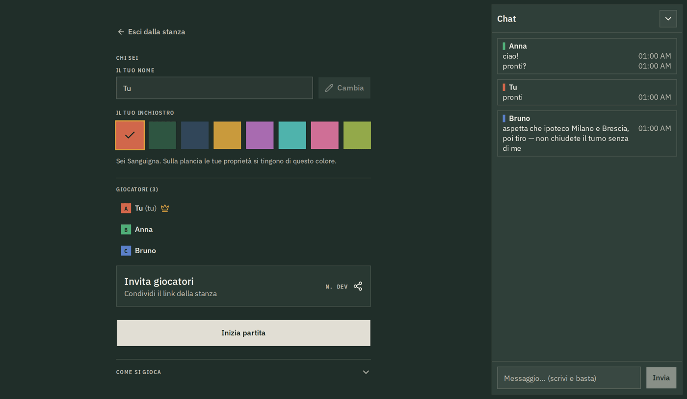
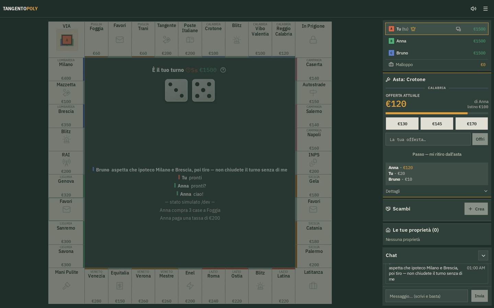
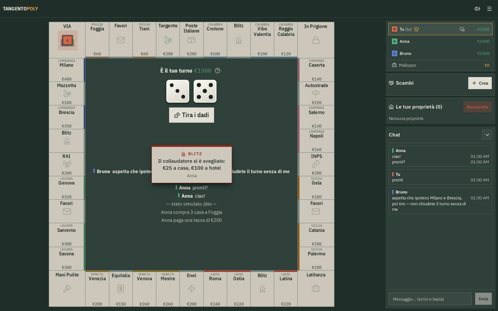

Tangentopoly è un gioco da tavolo multiplayer in tempo reale per un massimo di 8 giocatori. La struttura è quella del Monopoly — 40 caselle, 8 gruppi colore, case e hotel, aste, ipoteche, scambi — mentre il tabellone è contenuto originale sul tema di Tangentopoli: i gruppi colore sono regioni italiane, le stazioni sono partecipate di Stato (Poste Italiane, INPS, Enel, RAI), le società sono concessioni (Autostrade, Equitalia), il Parcheggio Gratuito è la Latitanza e il Vai in Prigione è Mani Pulite. L'accesso non richiede registrazione: si crea una stanza e si condivide il link.

import { ArrowRightIcon } from 'lucide-react'
import { Button } from '@/components/ui/button'
import { Link } from '@/components/ui/link'
import { Image } from 'astro:assets'
import mobilePlancia from './assets/mobile.png'
import mobileAsta from './assets/mobile-asta.png'

  <Link href="https://tangentopoly.it" target="_blank" className="w-full">
    <Button variant="outline" size="lg" className="w-full justify-between">
      Apri una stanza
      <ArrowRightIcon className="w-4 h-4" />
    </Button>
  </Link>

L'architettura è un monorepo pnpm con tre pacchetti: il **motore di gioco**, libreria pura senza I/O con PRNG inizializzato da seed, quindi deterministica e testabile; il **backend**, un Cloudflare Worker in cui ogni stanza è un Durable Object con stato persistito in un unico blob JSON; il **client**, React con store Zustand e trasporto WebSocket. Seguono le decisioni progettuali principali.

## Il limite di 8 giocatori deriva dalla palette

Sul tabellone un giocatore è identificato da tre attributi: colore, lettera di serie e offset della pedina all'interno della casella. I colori disponibili sono 8, selezionati per garantire un rapporto di contrasto di almeno 3:1 sul fondo. Oltre l'ottavo posto due pedine risulterebbero indistinguibili, quindi `addPlayer` rifiuta l'inserimento e il client entra in modalità spettatore, con stato e chat in sola lettura.

Il limite non è un parametro di configurazione ma una costante derivata dalla palette. Ogni colore ha inoltre un nome (Sanguigna, Verde valore, Indaco…) usato come etichetta accessibile, per non veicolare l'identità del giocatore con il solo colore.

## Ciclo di vita delle stanze senza processo di pulizia

Un namespace di Durable Object non è enumerabile: non esiste una query che restituisca le istanze attive, quindi non è implementabile un job di pulizia esterno. Ogni stanza deve gestire autonomamente la propria scadenza.

L'invariante adottata è che ogni transizione di stato lasci esattamente un alarm programmato: il timeout di turno durante la partita, altrimenti il timer di eliminazione — 5 minuti senza connessioni attive, 1 ora con connessioni attive ma partita ferma. Ogni ramo che esce dall'handler deve riprogrammare l'alarm anche quando non produce effetti, perché un'uscita anticipata lascia l'istanza priva di timer e non più recuperabile.

Ne deriva che la stanza è una sessione, non un salvataggio. In compenso la creazione di una stanza non istanzia il Durable Object (genera solo il codice), quindi i codici non vengono riservati e l'unicità è probabilistica: 6 caratteri su un alfabeto di 32, circa 10⁹ combinazioni.

## Timeout lato server su ogni stato di attesa

Gli stati di attesa hanno una scadenza: `preRoll` 60 s, `buyPrompt` 30 s, `postRoll` 60 s, `debt` 120 s; le aste usano un timer proprio, 10 s di apertura e 6 s dopo ogni rilancio. Alla scadenza il server applica l'azione di default dello stato; sul debito tenta il pagamento e, in caso di fondi insufficienti, esegue la bancarotta.

Poiché la partita avanza senza input del giocatore, l'interfaccia deve esporre il tempo residuo: countdown sul tabellone e una region `aria-live="polite"` che annuncia turno, esito del lancio, richiesta di acquisto e debito. L'esito del lancio era in precedenza reso con una sola trasformazione CSS, quindi non accessibile via screen reader.

## Sincronizzazione a stato pieno con replay degli eventi

Il server trasmette lo stato completo, con le posizioni già finali, insieme alla lista degli eventi della transizione. Applicando il solo stato, causa ed effetto — pesca della carta e spostamento in prigione — risulterebbero simultanei.

Il client esegue quindi un replay temporizzato degli eventi: movimento della pedina, comparsa della carta, spostamento in prigione. Il vincolo è che la presentazione possa ritardare lo stato autoritativo ma non contraddirlo; al termine del replay le posizioni vengono risincronizzate su quelle ricevute.

Il costo sono due rappresentazioni della stessa posizione — autoritativa e visualizzata — in campi distinti dello store. Con la tab in background i timer si accumulano, quindi al rientro in foreground la coda viene scartata e si salta allo stato finale.

  <video controls class="w-full" preload="metadata">
    <source src="/projects/tangentopoly/demo.mp4" type="video/mp4" />
    Il tuo browser non supporta il tag video.
  </video>

## Una sola tabella per interfaccia e validazione

Client e server devono conoscere l'insieme delle azioni legali nello stato corrente: il primo per abilitare i controlli, il secondo per rifiutare le richieste non valide. Due implementazioni separate divergono nel tempo.

`engine.ts` contiene quindi solo la topologia della macchina a stati, una tabella stato → handler. `legalActions()`, che alimenta l'interfaccia, e il controllo di ammissibilità in `apply()` leggono la stessa struttura. Anche i messaggi di rifiuto derivano da lì, quindi restano coerenti con lo stato corrente.

Le operazioni di liquidazione — ipoteca, vendita di case, vendita alla banca — e gli scambi restano fuori dalla tabella: sono legali in qualunque stato e anche fuori dal proprio turno, e sono dichiarate come eccezioni esplicite.

## Invarianti verificati a runtime, non solo nei test

In un gioco da tavolo gli errori tipici non producono eccezioni ma stati incoerenti e persistibili: case contabilizzate due volte, aste con offerenti già falliti, debiti a carico di giocatori usciti dalla partita.

`invariantViolations()` raccoglie le condizioni non ammesse — liquidità non negativa, conservazione di 32 case e 12 hotel tra tabellone e banca, nessuna proprietà intestata a giocatori usciti, turno assegnato a un giocatore attivo — ed è eseguita dai test dopo ogni azione accettata e dal server prima della persistenza: uno stato non valido non viene salvato né trasmesso. Restituisce l'elenco delle violazioni anziché un booleano, per la diagnostica in produzione.

A completamento, un soak test genera partite complete con azioni pseudo-casuali prevalentemente legali e verifica gli invarianti a ogni passo, coprendo le combinazioni che i test scritti manualmente non prevedono.

## Identificatore pubblico e token di posto

Lo stato pubblico contiene il `pid` di ogni giocatore, necessario al rendering di pedine, proprietà e turno. Il `pid` non può quindi fungere anche da credenziale di accesso al posto.

Al primo ingresso il server genera un token (UUID) e lo trasmette solo al client che occupa effettivamente il posto. Il token è persistito fuori dal blob di gioco, in modo che la funzione di redazione dello stato pubblico non possa esporlo per omissione. Una connessione con `pid` già assegnato e token errato viene degradata a spettatore. Dallo stato pubblico sono rimossi anche il seed del PRNG e l'ordine dei mazzi.

Il token risiede in `localStorage`: cambiando dispositivo a partita in corso si perde il posto. È il compromesso accettato per non gestire account.

## Overlay non bloccante durante le aste

Durante un'asta il tabellone non espone azioni di turno, e la soluzione immediata sarebbe applicare `inert`. Non è corretta: è proprio durante l'asta che serve liquidare proprietà per raccogliere liquidità, operazione che si avvia dalle caselle.

Il tabellone viene quindi coperto da un overlay con `pointer-events: none`, che segnala lo stato senza intercettare gli eventi.

## Vincoli della modalità standalone

Installata come PWA, l'applicazione si apre senza barra degli indirizzi e senza pulsante indietro: ogni uscita deve quindi essere prevista dall'interfaccia. L'azione `leave` fa parte del protocollo — libera il posto in lobby ed è il ritiro volontario a partita iniziata — e il codice stanza è sempre visibile in testata.

Su mobile i controlli di turno sono resi in una barra fissa tramite portal React, con un test end-to-end che ne verifica l'aggancio: un contenitore mancante la farebbe sparire senza errori a compile time. Il gioco offline non è supportato e non è implementabile, essendo il motore lato server; il service worker garantisce solo l'avvio dell'applicazione, che in assenza di rete mostra il banner di riconnessione.

  <Image src={mobilePlancia} alt="Layout mobile: tabellone, pannelli, barra dei controlli di turno" width={250} densities={[2]} class="h-auto w-1/2 max-w-[250px]" />
  <Image src={mobileAsta} alt="Asta su mobile: pannello dedicato e overlay sul tabellone" width={250} densities={[2]} class="h-auto w-1/2 max-w-[250px]" />

## Contenuto e identità visiva

Il tabellone è contenuto originale e non un re-skin: i gruppi colore seguono una progressione tematica, le partecipate occupano le posizioni delle stazioni, le concessioni quelle delle società. Le 32 carte sono scritte nello stesso registro ("Il vigile vuole il caffè: paga €15"). Il vincolo editoriale è che il riferimento sia il fenomeno e non le persone: nelle 40 caselle e nelle 32 carte non compare alcun nome di persona reale.

L'identità visiva deriva da un unico asset vettoriale, una marca da bollo. Da `bollo.svg` sono generati favicon, icona dell'applicazione con variante maskable e immagine di anteprima; i PNG sono prodotti da uno script, non ridisegnati.

## Fuori scope

- Nessun account, classifica o statistica tra partite. Il registro partite su D1, con dashboard Grafana privata, è strumentazione interna.
- Regolamento non configurabile: l'azione `updateSettings` è stata rimossa dal protocollo, non nascosta nell'interfaccia.
- Nessuna promozione da spettatore a giocatore a partita iniziata, nessun recupero di stanze eliminate.
- Contrasto colori non ancora misurato su render reale: i valori sono calcolati dai token.

Stack e numeri

| Pacchetto          | Contenuto                                                                              |
| ------------------ | -------------------------------------------------------------------------------------- |
| `src/`             | Client React 19, Vite 8, Tailwind 4, Radix UI, store Zustand, tipografia IBM Plex        |
| `packages/game/`   | Motore: `data/` → `rules/` → `core/` → `actions/`, con dipendenze unidirezionali         |
| `packages/server/` | Cloudflare Worker: Durable Object per stanza, WebSocket Hibernation API, D1 per il registro |

Test: Vitest sul motore (aste, carte, debito, espulsione, regole, rifiuti, timeout, soak) e tre script Playwright per il montaggio delle schermate su mobile e desktop, l'autorizzazione dei posti contro un server reale e l'installabilità della PWA.

Costanti di gioco: 40 caselle, 8 gruppi colore, 32 case e 12 hotel, 32 carte, 8 posti, €1500 di liquidità iniziale, codici stanza di 6 caratteri, log eventi e chat limitati a 100 elementi.

