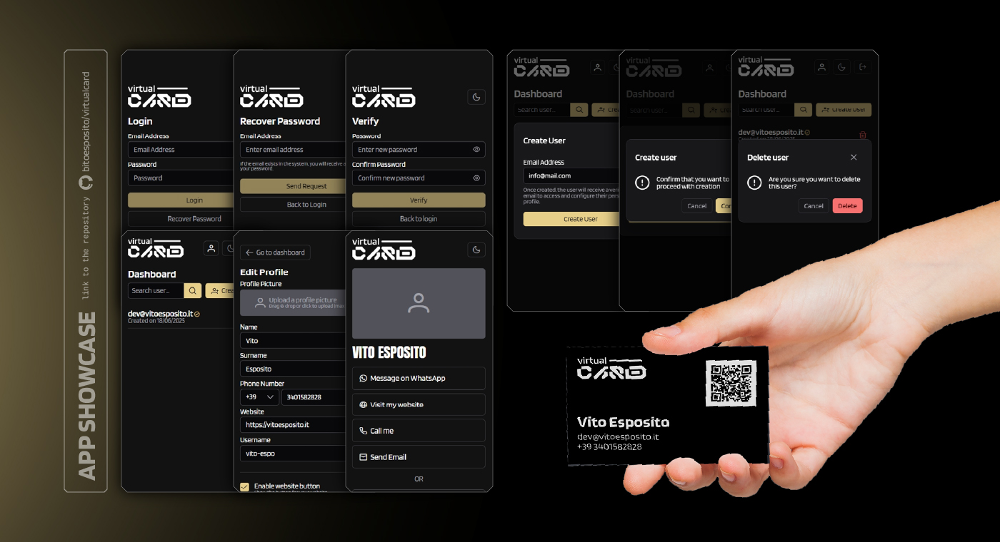
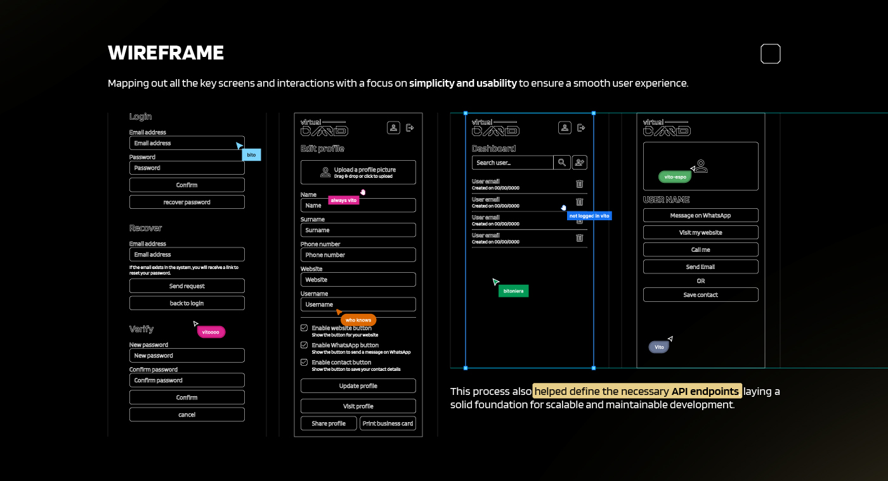
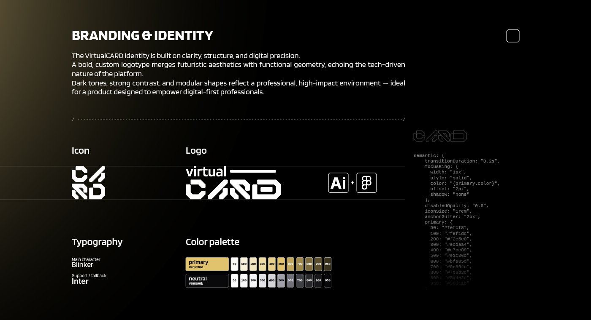

## Il Problema

VirtualCard nasce dall'esigenza di creare un sistema centralizzato per network marketing teams dove un amministratore può gestire una community di utenti, e ogni utente può creare il proprio biglietto da visita digitale sempre aggiornato, condivisibile via QR code.

Il problema principale è che i biglietti da visita tradizionali diventano obsoleti quando cambiano le informazioni di contatto, e c'è anche l'impatto ambientale dello spreco di carta.

## La Soluzione

Ho progettato VirtualCard come una piattaforma completa dove un amministratore crea gli account, gli utenti ricevono un'email, configurano il loro profilo e in pochi minuti hanno un biglietto da visita digitale professionale, condivisibile via QR code o link diretto.

Il sistema include biglietti da visita digitali con URL unico, esportazione PDF pronta per la stampa, generazione QR code, personalizzazione profilo con upload foto, autenticazione JWT con RBAC, design responsive con dark/light mode, dashboard amministratore per gestione utenti, recupero password sicuro e architettura API-First con API RESTful documentata.



## Come Funziona

L'amministratore ha accesso a una dashboard dove può vedere tutti gli utenti, creare nuovi account inserendo un'email, e gestire l'intera community. Quando crea un nuovo utente, il sistema invia automaticamente un'email con un link per impostare la password.

L'utente, dopo aver ricevuto l'email e impostato la password, accede a un'interfaccia dove può compilare le proprie informazioni personali, caricare una foto profilo che viene automaticamente ottimizzata, creare uno slug personalizzato per il proprio URL, e abilitare o disabilitare funzionalità specifiche (WhatsApp, sito web, vCard).

Può generare un QR code che punta direttamente al proprio profilo pubblico, accessibile a chiunque anche senza account, con pulsanti per chiamare, inviare un'email, aprire WhatsApp o visitare il sito web.

## Le Sfide Tecniche

La gestione delle dipendenze tra campi è stata una delle sfide più interessanti: se un utente abilita il pulsante WhatsApp, deve aver compilato il numero di telefono; se abilita il sito web, deve aver inserito un URL valido. Ho implementato queste validazioni sia lato frontend (per UX) che lato backend (per sicurezza).

La generazione del QR code è stata risolta usando `angularx-qrcode` per generare il codice direttamente nel frontend, basandomi sullo slug dell'utente. Il QR code punta sempre allo stesso URL, anche se l'utente modifica le proprie informazioni, garantendo che i biglietti stampati rimangano validi.

La gestione delle immagini è stata cruciale: ho implementato un servizio di ottimizzazione che ridimensiona e comprime automaticamente le foto caricate con Sharp, mantenendo la qualità ma riducendo drasticamente le dimensioni per migliorare i tempi di caricamento del profilo pubblico.

## Il Processo di Design

Il processo è iniziato con la ricerca e la pianificazione, mappando i flussi utente e definendo le funzionalità core con focus su semplicità e usabilità. L'obiettivo era creare un sistema che permettesse onboarding rapido degli utenti tramite pannello admin, creazione intuitiva di biglietti da visita pronti per la stampa, hub di contatto pubblico mobile-friendly per ogni utente, e scalabilità con gestione dati basata sui ruoli.

Ho creato wireframe dettagliati per mappare tutte le schermate chiave: flussi di autenticazione (login, recupero password, verifica), gestione profilo (upload foto con drag & drop, compilazione informazioni, creazione slug, toggle funzionalità, generazione QR), dashboard amministratore (lista utenti con ricerca, creazione ed eliminazione), e profilo pubblico (visualizzazione informazioni, pulsanti azione, download vCard).

Questo processo ha anche aiutato a definire gli endpoint API necessari.



L'identità di VirtualCard è costruita su chiarezza, struttura e precisione digitale. Un logotipo personalizzato unisce estetica futuristica e geometria funzionale, con toni scuri, contrasti forti e forme modulari.

La tipografia principale è Blinker con fallback Inter. La palette colori usa Primary `#e1c36d` (golden yellow) con scale da 50 a 950, e Neutral `#99990b` con scale complementari.

Il sistema di design utilizza transizioni fluide (0.2s), focus ring personalizzati e iconografia coerente.



## Implementazione

Ho implementato l'interfaccia con PrimeNG, che mi ha permesso di sviluppare rapidamente mantenendo un design professionale allineato ai wireframe. L'architettura backend è modulare: ogni feature è in un modulo separato (auth, users, common), rendendo il codice manutenibile e testabile.

Ho documentato tutto: API, database, architettura, regole di business, e ho creato una Postman collection per testare gli endpoint.

Questo progetto mi ha permesso di approfondire diversi aspetti dello sviluppo full-stack: gestione file storage con MinIO, ottimizzazione immagini con Sharp, implementazione sistema di ruoli robusto, e strutturazione applicazione Angular con lazy loading e route guards.

---

## Dettagli Tecnici

<details class="my-4 rounded-lg border border-border bg-muted/30">
<summary class="cursor-pointer px-4 py-2 font-medium hover:bg-muted/50">Stack Tecnologico</summary>
<div class="px-4 pb-4">

| Categoria | Tecnologia | Versione | Scopo |
|-----------|-----------|----------|-------|
| **Frontend** | Angular | 19 | Framework SPA |
| | PrimeNG | 19.1.3 | Component library |
| | PrimeFlex | 4.0.0 | Utility CSS |
| | TypeScript | 5.7 | Strict mode |
| **Backend** | NestJS | 11 | Framework API |
| | TypeORM | 11 | ORM |
| | PostgreSQL | Latest | Database |
| | Passport.js | - | JWT Auth |
| **Infrastruttura** | Docker | - | Containerizzazione |
| | Nginx | Alpine | Reverse proxy |
| | MinIO | - | Object storage |
| | Sharp | - | Image optimization |

</div>
</details>

<details class="my-4 rounded-lg border border-border bg-muted/30">
<summary class="cursor-pointer px-4 py-2 font-medium hover:bg-muted/50">Architettura & Deployment</summary>
<div class="px-4 pb-4">

### Docker Services

| Service | Image | Porte | Funzione |
|---------|-------|-------|----------|
| nginx | alpine | 80/443 | Reverse proxy |
| backend | node:23-slim | 3000 | NestJS API |
| frontend | node:23-slim | 4200 | Angular SPA |
| postgres | latest | 35000 | Database |
| minio | minio/minio | 9000/9001 | File storage |

### Volumes
- `postgres_data` - Persistenza database
- `minio_data` - Persistenza file storage

</div>
</details>

<details class="my-4 rounded-lg border border-border bg-muted/30">
<summary class="cursor-pointer px-4 py-2 font-medium hover:bg-muted/50">Database Schema</summary>
<div class="px-4 pb-4">

### Tabelle Principali

| Tabella | Chiave | Relazione |
|---------|--------|-----------|
| `auth_users` | uuid (PK) | One-to-One |
| `user_profiles` | uuid (PK) | ← auth_users |

### Campi Principali

**auth_users:**
- `email` (unique, max 255)
- `role` (enum: admin/user)
- `is_configured` (boolean)
- `reset_token` (max 511, 10min expiry)

**user_profiles:**
- `name`, `surname` (2-50 chars)
- `phone`, `area_code` (5-20, 2-10 chars)
- `website` (valid URL)
- `slug` (unique, [a-z0-9-])
- `profile_photo` (max 1024 chars)

**Triggers Automatici:**
- `update_updated_at_column()` - Gestione timestamp

</div>
</details>

<details class="my-4 rounded-lg border border-border bg-muted/30">
<summary class="cursor-pointer px-4 py-2 font-medium hover:bg-muted/50">API Endpoints</summary>
<div class="px-4 pb-4">

| Metodo | Endpoint | Descrizione | Accesso |
|--------|----------|-------------|---------|
| POST | `/auth/login` | Autenticazione JWT | Public |
| POST | `/auth/recover` | Password recovery | Public |
| POST | `/auth/verify` | Reset password | Public |
| POST | `/users/create` | Crea utente | Admin |
| GET | `/users/list` | Lista utenti | Admin |
| GET | `/users/:slug` | Profilo pubblico | Public |
| PUT | `/users/edit` | Modifica profilo | Owner/Admin |
| DELETE | `/users/delete` | Elimina utente | Owner/Admin |
| POST | `/users/upload-photo` | Upload foto (max 5MB) | Owner/Admin |

**Response Structure:**
```typescript
{ success: boolean; message: string; data: any | null; }
```

</div>
</details>

<details class="my-4 rounded-lg border border-border bg-muted/30">
<summary class="cursor-pointer px-4 py-2 font-medium hover:bg-muted/50">Validazioni & Regole</summary>
<div class="px-4 pb-4">

| Campo | Requisiti | Dipendenze |
|-------|-----------|------------|
| **Password** | 8-128 chars, maiusc+minusc+num+special | - |
| **Email** | Valid format, max 255, unique | - |
| **Slug** | [a-z0-9-], unique, non modificabile | Obbligatorio se vCard enabled |
| **Phone** | 5-20 chars | Obbligatorio se WhatsApp enabled |
| **Website** | Valid URL | Obbligatorio se Website enabled |
| **Foto** | JPG/PNG, max 5MB | Auto-ottimizzata con Sharp |

</div>
</details>

<details class="my-4 rounded-lg border border-border bg-muted/30">
<summary class="cursor-pointer px-4 py-2 font-medium hover:bg-muted/50">Ruoli & Permessi</summary>
<div class="px-4 pb-4">

| Funzionalità | USER | ADMIN |
|--------------|------|-------|
| Login/Logout | ✅ | ✅ |
| Profilo pubblico | ✅ | ✅ |
| Modifica profilo proprio | ✅ | ✅ |
| Eliminazione account | ✅ (proprio) | ✅ (tutti) |
| Upload foto | ✅ | ✅ |
| Generazione QR | ✅ | ✅ |
| Lista utenti | ❌ | ✅ |
| Creazione utenti | ❌ | ✅ |
| Dashboard admin | ❌ | ✅ |

</div>
</details>

<details class="my-4 rounded-lg border border-border bg-muted/30">
<summary class="cursor-pointer px-4 py-2 font-medium hover:bg-muted/50">Sicurezza</summary>
<div class="px-4 pb-4">

### Security Layers

| Layer | Implementazione |
|-------|-----------------|
| **Network** | SSL/TLS, Firewall, Rate limiting |
| **Application** | JWT Auth, RBAC, Input validation, XSS/CSRF protection |
| **Data** | bcrypt hashing, Encryption at rest, Backups |

### Security Headers
- `X-Frame-Options`, `X-Content-Type-Options`
- `X-XSS-Protection`, `Content-Security-Policy`
- `Strict-Transport-Security`

</div>
</details>

<details class="my-4 rounded-lg border border-border bg-muted/30">
<summary class="cursor-pointer px-4 py-2 font-medium hover:bg-muted/50">Documentazione</summary>
<div class="px-4 pb-4">

Tutta la documentazione è disponibile nel repository GitHub:

- `docs/api.md` - API endpoints completi
- `docs/database.md` - Schema database
- `docs/architecture-map.md` - Mappa architetturale
- `docs/functional-documentation.md` - Regole di business
- `docs/roles.md` - Ruoli e permessi
- `docs/virtualcard.postman_collection.json` - Postman collection

</div>
</details>
