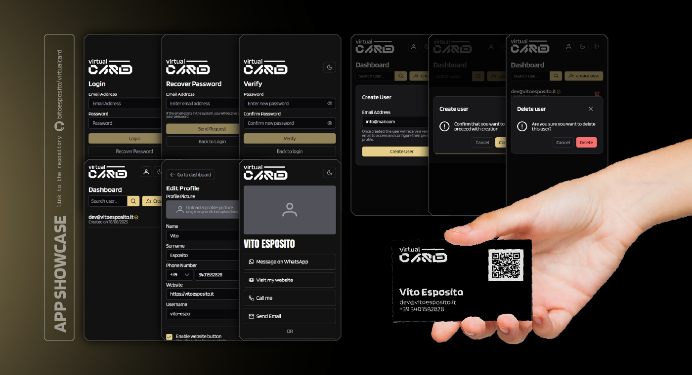
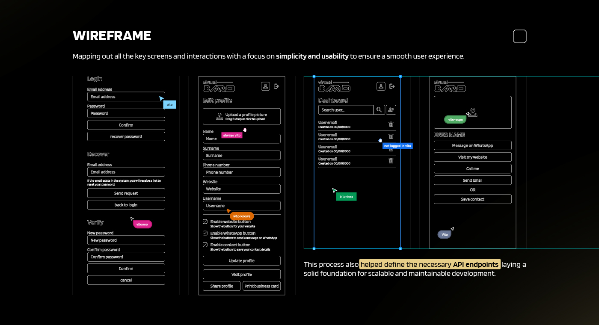
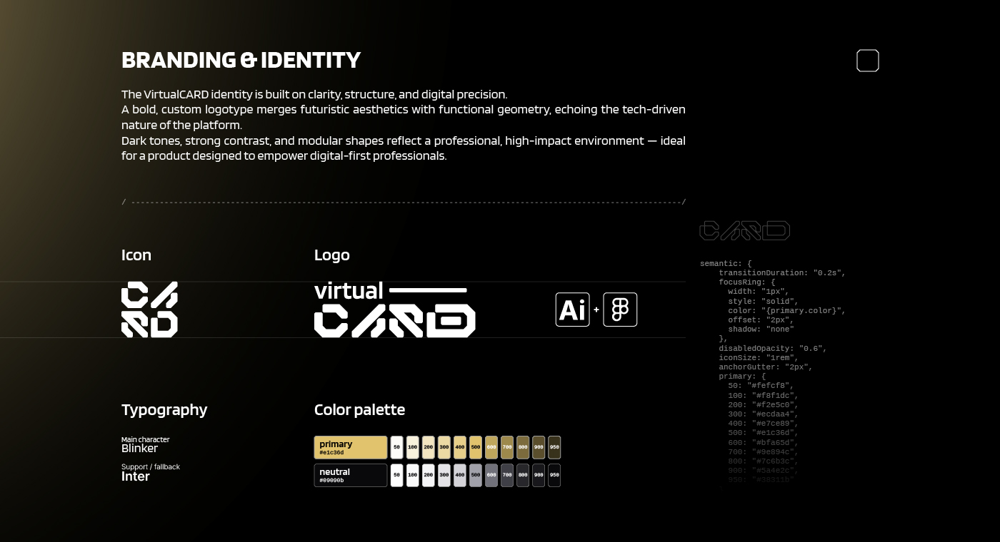

VirtualCard sostituisce il biglietto da visita di carta con una pagina pubblica. Ogni utente ha un indirizzo e un codice QR: chi lo inquadra trova nome, foto e contatti come pulsanti, e può salvare il contatto in rubrica o scaricare il biglietto in PDF.

## Contesto

Il progetto è il lavoro finale del mio percorso di studi, ed è nato con un vincolo preciso: doveva essere un'applicazione completa, dal database al dominio, non un esercizio su una sola parte. Da qui la scelta di un fronte e un retro separati, un database relazionale, un archivio per i file e un proxy davanti a tutto, orchestrati insieme.

Il destinatario è un'organizzazione che distribuisce biglietti ai propri membri. Non esiste registrazione libera: è un amministratore a creare l'utenza, e la persona riceve un'email per impostare la password e configurare il proprio profilo. L'interfaccia è in inglese, con il livello di traduzione già montato e una sola lingua caricata.

## Com'è fatta

| Componente | Scelta | Cosa comporta |
| --- | --- | --- |
| Fronte | Angular con PrimeNG | Moduli caricati su richiesta e separati tra area pubblica e area privata, con un guard sulla seconda |
| Retro | NestJS con TypeORM | Controller sottili, servizi con la logica, validazione dichiarata sui DTO |
| Database | PostgreSQL | Due entità separate, l'utenza con le credenziali e il profilo con i dati del biglietto |
| File | MinIO, compatibile con S3 | Le foto stanno fuori dal database e vengono servite con URL firmati a scadenza |
| Rete | nginx davanti a tutto | Un solo ingresso su HTTPS, con i certificati montati dal volume di Let's Encrypt |
| Esecuzione | Docker Compose | Un comando alza proxy, fronte, retro, database e archivio file insieme |

Le due entità separate sono la decisione strutturale che conta. `users` tiene email, password cifrata con bcrypt, ruolo e token di reset; `user_profiles` tiene tutto quello che finisce sul biglietto. Una pagina pubblica legge quindi solo la seconda tabella, e non c'è modo che una credenziale finisca in una risposta pubblica per distrazione.

## Accesso e ruoli

I ruoli sono due, amministratore e utente, e sono applicati con un guard sui controller invece che nell'interfaccia. Creare e elencare le utenze è riservato all'amministratore; modificare ed eliminare il proprio profilo è di entrambi.

Il recupero della password è in due passi, con due schermate distinte. «Recover Password» accetta l'email e invia un messaggio con un token; «Verify» accetta il token, la nuova password e la sua conferma. Il token ha una scadenza salvata accanto a sé nel database, quindi un collegamento vecchio smette di funzionare da solo.

## Il profilo

La configurazione del profilo raccoglie nome, cognome, prefisso e numero di telefono, sito, foto e **slug**, cioè la parola che compare nell'indirizzo pubblico. Lo slug si controlla mentre si scrive, su un endpoint dedicato, perché deve essere unico e perché scoprirlo occupato solo al salvataggio costringerebbe a rifare il modulo.

La foto si carica per trascinamento o dal selettore, viene archiviata su MinIO e non finisce mai nel database, che ne conserva soltanto il riferimento.

Tre interruttori decidono cosa comparirà sulla pagina pubblica: il pulsante di WhatsApp, quello del sito e il download del contatto. Un campo compilato non appare per forza: lo si abilita.

## La pagina pubblica

La pagina raggiungibile dallo slug è quella che si mostra agli altri. Porta foto, nome e i contatti come pulsanti diretti: scrivere su WhatsApp, aprire il sito, chiamare, mandare un'email, ciascuno presente solo se il dato c'è e l'interruttore è attivo.

Due funzioni girano interamente nel browser, senza chiedere niente al server.

Il **contatto** viene composto come file vCard e scaricato con il nome della persona: chi lo apre se lo ritrova in rubrica, con telefono, email e sito già compilati.

Il **biglietto in PDF** viene costruito su un modello vettoriale, in cui i dati vengono scritti con i caratteri del progetto e il codice QR viene generato al momento e inserito come immagine. Il risultato è un file pronto per la stampa, che riproduce il biglietto fisico con il QR che riporta alla pagina.

## Cosa l'applicazione non fa

- Non ha una registrazione pubblica. Un'utenza nasce solo da un amministratore, e chi arriva senza invito non ha modo di crearsene una.
- Non misura niente. Nessun conteggio delle visite alla pagina pubblica, nessuna statistica sulle scansioni del QR.
- Non gestisce più biglietti per persona: un'utenza ha un profilo, e quindi uno slug e una pagina.
- Non ha temi o layout alternativi per la pagina pubblica: l'aspetto è uno solo per tutti.
- Non è multilingua nei fatti. Il livello di traduzione esiste, ma il solo file caricato è l'inglese.
- Non è pubblicata da nessuna parte: si esegue con Docker Compose, e non c'è un'istanza dimostrativa online.

Glossario

| Termine | Significato |
| --- | --- |
| Slug | Parola leggibile che identifica una risorsa nell'indirizzo, al posto di un codice |
| JWT | Token firmato che il client presenta a ogni richiesta per dimostrare di essere autenticato |
| Guard | Componente che decide se una richiesta può proseguire; qui verifica il token e il ruolo |
| DTO | Oggetto che descrive la forma dei dati in ingresso, su cui si dichiarano le regole di validazione |
| vCard | Formato standard dei contatti, con estensione `.vcf`, che i telefoni importano in rubrica |
| URL firmato | Collegamento temporaneo a un file privato, valido per un tempo limitato e senza credenziali |
| MinIO | Archivio di file compatibile con il protocollo S3, eseguibile sulla propria infrastruttura |

