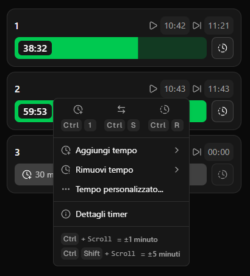
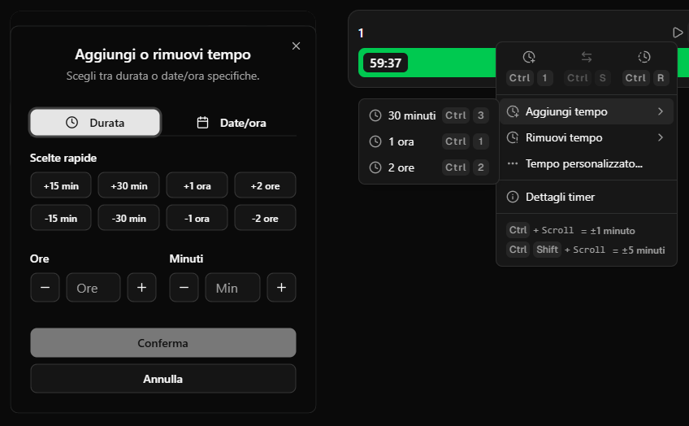

## Il Problema

Un amico gestisce una sala LAN e aveva bisogno di un sistema per monitorare i turni dei clienti alle postazioni. Il vecchio software, sviluppato in Java, era funzionale ma con un'interfaccia e un'esperienza utente spartana che rendeva l'uso quotidiano poco efficiente.

Ho deciso di fare un completo redesign e rework dell'applicazione, trasformandola in una moderna app desktop con Electron e Next.js, mantenendo tutte le funzionalità essenziali ma aggiungendo un'interfaccia intuitiva e funzionalità avanzate.

## La Soluzione

WolfDen Manager è un'applicazione desktop cross-platform (Windows, macOS, Linux) costruita con Electron e Next.js 16, che permette di gestire in modo efficiente i turni dei clienti in una sala LAN. L'applicazione offre organizzazione in sezioni personalizzabili, sistema di timer avanzato con multiple modalità, shortcut da tastiera per operazioni rapide, supporto tema chiaro/scuro, e persistenza automatica dei dati in locale.

{/*  */}

## Come Funziona

L'applicazione permette di organizzare le postazioni in sezioni personalizzabili. Ogni sezione può contenere multiple postazioni, permettendo una gestione flessibile della sala. Il cuore dell'applicazione è il sistema di timer, che offre diverse modalità di gestione: timer con durata predefinita o personalizzata, timer con date/ora specifiche per impostazione precisa di inizio e fine turno, aggiunta/rimozione tempo per modifica dinamica del timer in corso, progress bar visiva con colori che cambiano in base al tempo rimanente, notifiche audio quando il timer scade, e scambio postazioni per trasferimento rapido del timer tra postazioni diverse.

Per velocizzare le operazioni quotidiane, l'applicazione supporta numerosi shortcut: Ctrl+E per attivare/disattivare modalità modifica, Ctrl+M per attivare/disattivare audio, Ctrl+1/2/3 per avviare timer o aggiungere tempo (1h, 2h, 30min) quando una card è selezionata, Ctrl+S per scambiare postazione quando timer attivo, Ctrl+R per resettare timer, e Ctrl+Scroll per aggiungere/rimuovere tempo con precisione al minuto.

{/*  */}

Tutti i dati (sezioni, postazioni, timer attivi) vengono salvati automaticamente in locale, garantendo che nessuna informazione vada persa anche in caso di chiusura improvvisa dell'applicazione. Lo stato dell'applicazione è centralizzato in un Context Provider che gestisce sezioni e postazioni, timer attivi, e aggiornamenti in tempo reale con un singolo interval globale per ottimizzare le performance.

{/*  */}

## Le Sfide Tecniche

La gestione dello stato globale è stata una delle sfide principali. Ho implementato un Context Provider centralizzato che gestisce tutto lo stato dell'applicazione, evitando prop drilling e garantendo aggiornamenti efficienti. Per ottimizzare le performance, ho utilizzato un singolo interval globale che aggiorna tutti i timer attivi ogni secondo invece di creare un interval per ogni timer, riducendo drasticamente il consumo di risorse.

La persistenza dei dati in locale è stata implementata usando localStorage con serializzazione personalizzata per gestire strutture dati complesse come Map. Il sistema include versioning per future migrazioni e gestione degli errori per casi limite come quota exceeded. Il salvataggio è debounced a 500ms per evitare scritture eccessive durante modifiche rapide.

La gestione del tempo è stata complessa: ho implementato un sistema basato su ISO timestamps completi con supporto timezone (Europe/Rome) per gestire correttamente date e orari, incluso il crossing di mezzanotte. Il calcolo del progress è ottimizzato per mostrare la barra al 100% quando rimangono più di un'ora, poi diminuisce linearmente nell'ultima ora, e mostra valori oltre 100% quando il timer è scaduto per indicare visivamente il ritardo.

{/*  */}

## Architettura e Design Patterns

L'applicazione è stata strutturata secondo un principio di separazione di responsabilità. Le features contengono la logica di business isolata (cards, sections, timers) con servizi dedicati per operazioni complesse, i components sono componenti UI riutilizzabili e composabili basati su Radix UI per accessibilità, gli hooks contengono logica riutilizzabile per interazioni e calcoli (timer calculations, card interactions, global shortcuts), e i services gestiscono operazioni complesse come persistenza e calcoli dei timer.

L'uso di Next.js 16 in un contesto Electron ha richiesto configurazioni specifiche: output statico per generare file nella directory 'out', immagini non ottimizzate per compatibilità Electron, e gestione del routing statico. Ho utilizzato Tailwind CSS 4 per lo styling e Radix UI per i componenti accessibili, garantendo un'interfaccia moderna e professionale. Il sistema di build supporta packaging per Windows (portable, zip), macOS (dmg, zip) e Linux (appimage, zip) tramite electron-builder.

---

## Showcase video

<div class="my-8 rounded-lg overflow-hidden border border-border bg-muted/30">
  <video 
    controls 
    class="w-full"
    poster="./assets/cover.png"
    preload="metadata"
  >
    <source src="/projects/wolfden-manager/demo.mp4" type="video/mp4" />
    Il tuo browser non supporta il tag video.
  </video>
</div>

---

## Dettagli Tecnici

<details class="my-4 rounded-lg border border-border bg-muted/30">
<summary class="cursor-pointer px-4 py-2 font-medium hover:bg-muted/50">Stack Tecnologico</summary>
<div class="px-4 pb-4">

| Categoria | Tecnologia | Versione | Scopo |
|-----------|-----------|----------|-------|
| **Framework** | Electron | 39.1.1 | Desktop app framework |
| | Next.js | 16.0.1 | React framework |
| | React | 19.2.0 | UI library |
| **Linguaggio** | TypeScript | 5 | Type safety |
| **Styling** | Tailwind CSS | 4 | Utility-first CSS |
| **UI Components** | Radix UI | Latest | Accessible components |
| | lucide-react | 0.552.0 | Icon library |
| **Utilities** | dayjs | 1.11.19 | Date/time manipulation |
| | date-fns | 4.1.0 | Date utilities |
| | sonner | 2.0.7 | Toast notifications |
| **Build Tools** | electron-builder | 26.0.12 | App packaging |

</div>
</details>

<details class="my-4 rounded-lg border border-border bg-muted/30">
<summary class="cursor-pointer px-4 py-2 font-medium hover:bg-muted/50">Funzionalità Principali</summary>
<div class="px-4 pb-4">

| Funzionalità | Descrizione |
|--------------|-------------|
| **Organizzazione Sezioni** | Sezioni personalizzabili con multiple postazioni |
| **Sistema Timer** | Timer con durata, date/ora specifiche, aggiunta/rimozione tempo |
| **Progress Bar** | Indicatore visivo con colori dinamici (default/warning/orange/destructive) |
| **Notifiche Audio** | Allarme quando timer scade (gestito con useAudio hook) |
| **Scambio Postazioni** | Trasferimento timer tra postazioni diverse |
| **Shortcut Tastiera** | Operazioni rapide da tastiera (globale e card-specific) |
| **Tema Chiaro/Scuro** | Supporto per preferenze utente (next-themes) |
| **Persistenza Locale** | Salvataggio automatico dati in localStorage con versioning |

</div>
</details>

<details class="my-4 rounded-lg border border-border bg-muted/30">
<summary class="cursor-pointer px-4 py-2 font-medium hover:bg-muted/50">Shortcut da Tastiera</summary>
<div class="px-4 pb-4">

| Shortcut | Azione | Scope |
|----------|--------|-------|
| `Ctrl+E` | Attiva/disattiva modalità modifica | Globale |
| `Ctrl+M` | Attiva/disattiva audio | Globale |
| `Ctrl+1/2/3` | Avvia timer o aggiungi tempo (1h, 2h, 30min) | Card selezionata |
| `Ctrl+S` | Scambia postazione (timer attivo) | Card con timer |
| `Ctrl+R` | Resetta timer | Card con timer |
| `Ctrl+Scroll` | Aggiungi/rimuovi tempo (precisione minuto) | Card con timer |

**Note:** Gli shortcut globali sono disabilitati quando l'utente sta digitando in campi input.

</div>
</details>

<details class="my-4 rounded-lg border border-border bg-muted/30">
<summary class="cursor-pointer px-4 py-2 font-medium hover:bg-muted/50">Architettura</summary>
<div class="px-4 pb-4">

### Struttura Progetto

```
wolfden-manager/
├── app/                    # Next.js app directory
├── components/             # Componenti UI riutilizzabili
│   ├── cards/              # Componenti specifici per cards
│   ├── sections/           # Componenti per sezioni
│   ├── layout/             # Layout components
│   ├── providers/          # Context providers
│   └── ui/                 # Radix UI components
├── features/               # Logica di business isolata
│   ├── cards/              # Servizi per gestione cards
│   ├── sections/           # Servizi per gestione sezioni
│   └── timers/             # Servizi per logica timer
├── hooks/                  # Custom hooks
│   ├── use-timer-calculations.ts
│   ├── use-global-shortcuts.ts
│   ├── use-card-interactions.ts
│   └── ...
├── lib/                    # Utilities e servizi
│   ├── storage/            # Servizio persistenza
│   └── utils/              # Utility functions (time, keyboard, sound)
├── store/                  # State management
│   └── app-store.tsx       # Context Provider centralizzato
├── main/                   # Electron main process
│   ├── main.js             # Entry point Electron
│   └── preload.js          # Preload script
└── types/                  # TypeScript types
```

### State Management

- **AppStoreProvider**: Context Provider centralizzato per stato globale
- **Single interval**: Aggiornamento globale tutti i timer ogni 1 secondo
- **Persistenza automatica**: Salvataggio debounced (500ms) in localStorage
- **Serializzazione Map**: Conversione Map in array per JSON (chiave: number, valore: UserCard[])
- **Versioning**: Sistema di versioning per future migrazioni dati

### Timer System

- **ISO Timestamps**: Uso di timestamp ISO completi con timezone (Europe/Rome)
- **Progress Calculation**: Barra al 100% se >1h rimanente, poi lineare nell'ultima ora
- **Expired State**: Valori >100% per indicare timer scaduto
- **Color Variants**: default/warning/orange/destructive basati su tempo rimanente
- **Audio Notifications**: Suono automatico quando timer scade (gestito con useAudio)

</div>
</details>

<details class="my-4 rounded-lg border border-border bg-muted/30">
<summary class="cursor-pointer px-4 py-2 font-medium hover:bg-muted/50">Persistenza Dati</summary>
<div class="px-4 pb-4">

### Storage Service

Il servizio di persistenza gestisce il salvataggio e caricamento dello stato dell'applicazione in localStorage.

**Struttura Dati:**
```typescript
interface SerializedState {
  version: number;                    // Versione per migrazioni future
  sections: Section[];                // Array di sezioni
  cardsBySection: Array<[number, UserCard[]>];  // Map serializzata come array
}
```

**Caratteristiche:**
- **Versioning**: Controllo versione per future migrazioni
- **Map Serialization**: Conversione Map in array per JSON serialization
- **Error Handling**: Gestione errori (quota exceeded, parsing errors)
- **Auto-save**: Salvataggio automatico con debounce (500ms)
- **Progress Recalculation**: Ricalcolo progress al caricamento per timer attivi

</div>
</details>

<details class="my-4 rounded-lg border border-border bg-muted/30">
<summary class="cursor-pointer px-4 py-2 font-medium hover:bg-muted/50">Electron Configuration</summary>
<div class="px-4 pb-4">

### Main Process

- **Window Size**: 500x800 (min: 360x600)
- **Menu Bar**: Auto-hide menu bar
- **Security**: Context isolation enabled, node integration disabled
- **Dev Mode**: Auto-reload su fail load, DevTools aperti in sviluppo

### Build Configuration

**Windows:**
- Target: dir, portable, zip
- Icon: `public/icon.ico`

**macOS:**
- Target: dir, dmg, zip
- Icon: `public/icon.icns`
- Category: Utilities

**Linux:**
- Target: dir, appimage, zip
- Icon: `public/icon.png`
- Category: Utility

**Files Included:**
- `out/**/*` (Next.js static export)
- `main/**/*` (Electron main process)
- `package.json` e `node_modules` (esclusi file di sviluppo)

</div>
</details>

<details class="my-4 rounded-lg border border-border bg-muted/30">
<summary class="cursor-pointer px-4 py-2 font-medium hover:bg-muted/50">Time Management</summary>
<div class="px-4 pb-4">

### Time Utilities

Il sistema di gestione del tempo utilizza dayjs con plugin timezone per gestire correttamente date e orari.

**Funzionalità:**
- **Timezone Support**: Europe/Rome timezone per tutti i calcoli
- **ISO Timestamps**: Uso di timestamp ISO completi per precisione
- **Midnight Crossing**: Gestione corretta del crossing di mezzanotte
- **Time Formatting**: Formattazione HH:mm e HH:mm:ss per display
- **Progress Calculation**: Calcolo progress basato su secondi rimanenti
- **Expired Detection**: Rilevamento timer scaduti con valori negativi

**Progress Bar Logic:**
- 100% se rimangono >1 ora
- Lineare da 100% a 0% nell'ultima ora
- >100% quando scaduto (fino a 200% max) per indicare ritardo

</div>
</details>
